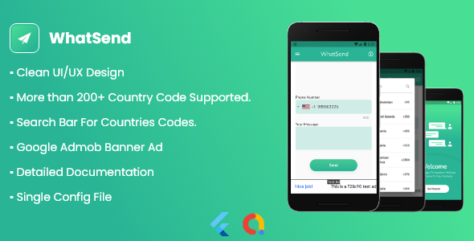

<h1>Features</h1>   

<h2 class="anchor anchorWithStickyNavbar_LWe7" id="developmentreskin-features">Development/Reskin Features<a class="hash-link" href="#developmentreskin-features" title="Direct link to heading">​</a></h2><ul class=""><li>Clean<strong> UI/UX </strong>design</li><li>Well separated code files ( you can config the app from one single file ).</li><li>A Complete Friendly <strong>Documentation</strong> For <strong>Developers And Non-Developers</strong>, Containing:<ul class=""><li>Every Config Parameter</li><li>Changing Application Name</li><li>Changing Package Name</li><li>Changing Icons</li><li>Changing Splash Screen</li></ul></li><li>Ability To Change Pages Content With Just Markdown (.md)</li><li>And More !</li></ul><h2 class="anchor anchorWithStickyNavbar_LWe7" id="app-features">App Features<a class="hash-link" href="#app-features" title="Direct link to heading">​</a></h2><ul class=""><li>More than 200+ country code supported.</li><li>Search Bar For Countries Codes.</li><li>Auto redirect to the <strong>WhatsApp</strong> Application.</li><li>Caching Last Message The User Inputs For The Next Application Opening.</li><li>Caching Last Number The User Inputs For The Next Application Opening.</li><li><strong>Admob</strong> Banner Ad</li><li>How To Use Screen</li><li>Privacy &amp; Policies Screen</li><li>And More !</li></ul>

